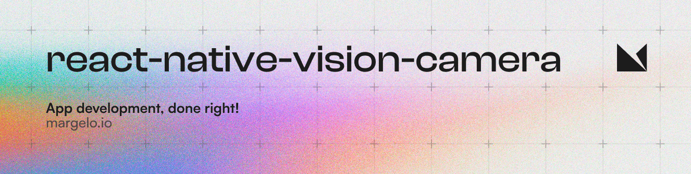

<a href="https://margelo.io">
  <picture>
    <source media="(prefers-color-scheme: dark)" srcset="img/banner-light.png" />
    <source media="(prefers-color-scheme: light)" srcset="img/banner-light.png" />
    
  </picture>
</a>

<br />

<div>
  
</div>

### Features

VisionCamera is a powerful, high-performance Camera library for React Native. It features:
This is fork from (https://github.com/mrousavy/react-native-vision-camera)

Install VisionCamera from npm:

```sh
yarn add pg-react-native-vision-camera
cd ios && pod install
```

..and get started by [setting up permissions](https://react-native-vision-camera.com/docs/guides)!

### Updated below files for iOS 

* react-native-vision-camera/ios/CameraView+AVAudioSession.swift
* react-native-vision-camera/ios/CameraView+AVCaptureSession.swift
* react-native-vision-camera/ios/CameraView+RecordVideo.swift
* react-native-vision-camera/ios/Extensions/AVCaptureDevice.Format+videoDimensions.swift
* react-native-vision-camera/ios/CameraView.swift

### which persists below issue

* Type 'AVAudioSession.Category' (aka 'NSString') has no member 'playAndRecord'
* 'AVAudioSession.Mode' (aka 'NSString') is not implicitly convertible to 'String'; did you mean to use 'as' to explicitly convert?
* 'AVAudioSession.Category' (aka 'NSString') is not implicitly convertible to 'String'; did you mean to use 'as' to explicitly convert?
* many more that not listed here.


### For successfully run on iOS please install this package.

  


